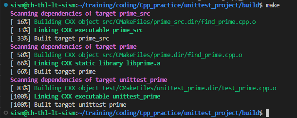

# coding
My own coding practice

# To do
- [x] Binary search
- [ ] Self balancing binary search tree
- [ ] Remove repeated elements in array without sorting them
- [ ] Two-pointer problems

1. Data structures:
    * Arrays, Linked Lists, Stacks, Queues, Trees, Graphs, Heaps, Hash sets, Hash maps

1. Algorithms:
    - Breadth first search, Depth first search, Binary search, 
    - Quicksort, Mergesort, 
    - A*, 
    - Dynamic programming, Recursion, Divide and conquer

# Git SSH access rights
if you get the error   

    > git@github.com: Permission denied (publickey).
    > fatal: Could not read from remote repository.
Perform these steps:

1.  `cat /etc/resolv.conf` has nameserver 8.8.4.4
2.  Check `git config --local --list`
3.  Add SSH key of your profile to ssh agent, `ssh-add /<dir>/github/id_rsa`
4.  Enter `ssh -T git@github.com`

        Hi <username>! You've successfully authenticated, but GitHub does not provide shell access.

# Unit tests
## Linux Setup
Googletest could be added as a submodule or as a Linux utility
### Development package, as a part of Linux tools
Download it as a pre-built library [Guide here on dev package](https://www.eriksmistad.no/getting-started-with-google-test-on-ubuntu/). By installing libgtest-dev, two directories are created

    /usr/src/gtest
    /usr/src/googletest

```
    sudo apt install libgtest-dev build-essential cmake
    cd /usr/src/gtest
    sudo cmake CMakeLists.txt
        -- Configuring done
        -- Generating done
        -- Build files have been written to: /usr/src/googletest/googletest
    sudo make
```
By this step, Two libs are built and linked;

    /usr/src/gtest/lib/libgtest.a
    /usr/src/gtest/lib/libgtest_main.a

Copy or symlink these two to /usr/lib
```
    sudo ln -s /usr/src/gtest/lib/libgtest.a /usr/lib
    sudo ln -s /usr/src/gtest/lib/libgtest_main.a /usr/lib
```

### Build tests
In src/ and test/, the CMakeLists.txt allow them to compile independently.
    cmake CMakeLists.txt 
    make
There will be executables generated with the name provided


To collectively build src and unit test executables, and keep the auto-generated files contained in one directory only
```
    mkdir build && cd build
    cmake -S ../ -B . # -Src dir is parent, -Build dir is current 
    make
```
### Run tests
To run the tests, go into build directory
```
    ./build/src/main # Only source code executable
    ./build/test/unittest_run 
        [==========] Running 3 tests from 1 test suite.
        [----------] Global test environment set-up.
        [----------] 3 tests from MyTest
        [ RUN      ] MyTest.valid_answers
        [       OK ] MyTest.valid_answers (0 ms)
        [  PASSED  ] 2 tests
```

### Submodule method
```
git submodule add https://github.com/google/googletest.git
git submodule update --init --recursive
mkdir build/ && cd build
cmake -S ../ -B . # -Src dir is parent, -Build dir is current 
sudo ldconfig -v | egrep 'gtest|gmock'
```
<!-- This content will not appear in the rendered Markdown -->
### Draft
Another method is 
```
    sudo apt install googletest
    cd /usr/src/googletest/
    sudo cmake .
    sudo cmake --build . --target install
```
Files will be located in 
    /usr/local/lib/libgtest_main.a
    /usr/local/lib/libgtest.a

    
    

